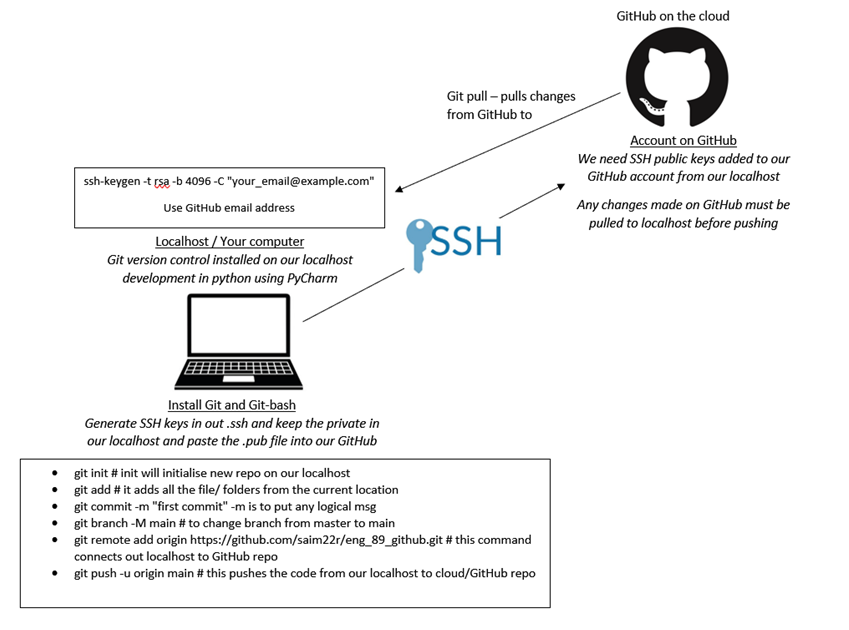
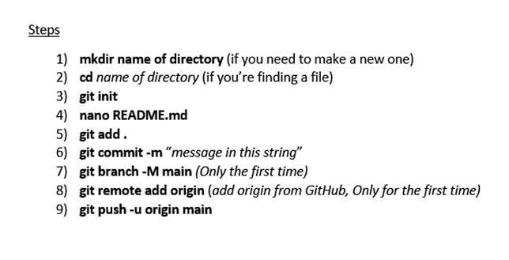

# GitHub, Git and SSH key set up

- Download and install GitBash and Git version control onto your computer.  [https://git-scm.com/](Download Git)
- Create a GitHub account by visiting the GitHub homepage
- Open GitBash from start button as an administrator to generate an SSH key
- Copy and paste `s0sh-keygen -t rsa -b 4096 -C "your_email@example.com"` replacing the email with your Github email. This is for windows only
- Type in Use `cd .ssh` into the terminal
- Keep pressing enter until a .pub appears
- Type in cat id_rsa.pub to find the content
- Copy and paste this .pub to GitHub. `Settings -> SSH keys -> New key`
  
# Summary image of the steps
-  

# Simple Steps for pushing code from PyCharm to GitHub
- 
